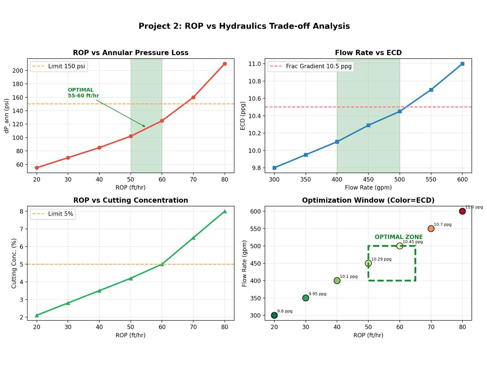

# ROP vs Hydraulics Trade-off Analysis

## Objetivo
Análisis de trade-off entre ROP y eficiencia hidráulica - Hole Cleaning y control de ECD.

## Resultados Clave
- **Óptimo:** 50-60 ft/hr con 400-500 gpm
- ECD < 10.5 ppg (bajo gradiente de fractura)
- Cutting concentration < 5% para evitar pack-off

## Dashboard de Resultados

## Herramientas
Python, Hydraulics, Moore & Chien Model

**Autor:** José | Petroleum Engineer
